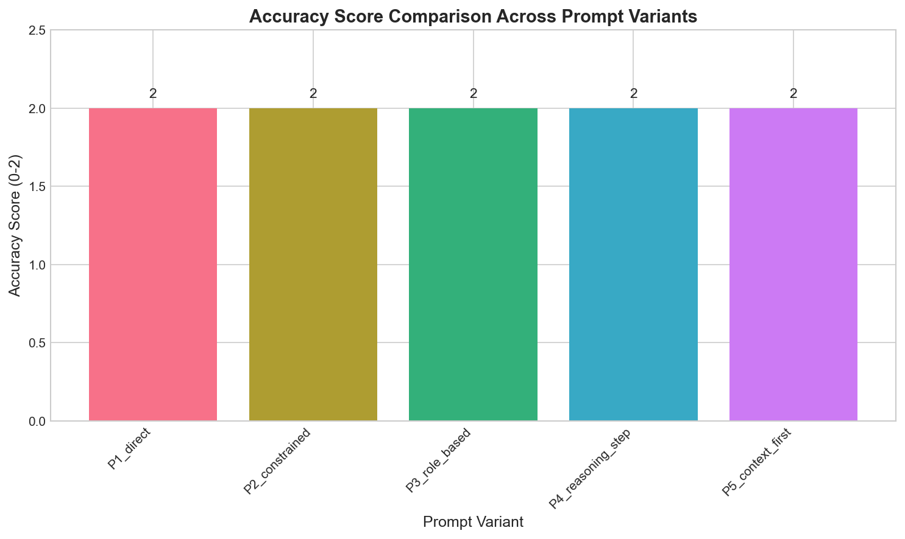
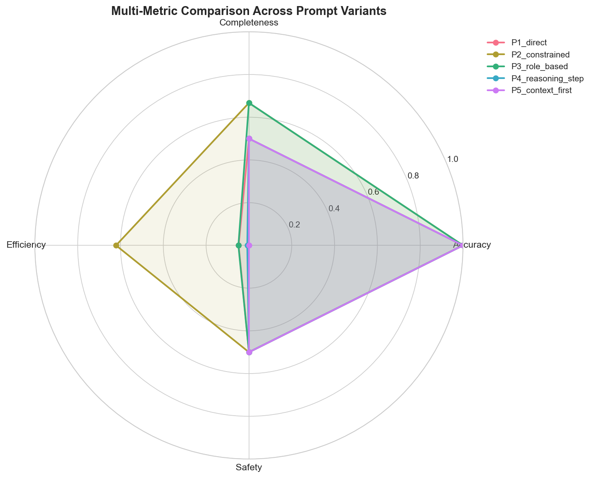

# LLM Lab: Prompt Engineering Team Report

**Course:** EDS 6344 AI for Engineers  
**Theme:** Prompt Engineering, Reasoning Control, and Model‑Aware Question Design  
**Domain:** Supply Chain Optimization

---

## 1. Introduction

This report documents our investigation into how prompt phrasing, structure, and applied constraints influence LLM response quality for engineering contexts. We evaluated five distinct prompt designs using Google Gemini to develop practical guidelines for effective prompting.

**Research Question:** How do different prompt structures affect accuracy, completeness, and reliability of LLM responses for supply chain optimization queries?

---

## 2. Prompt Variants and Design Rationale

| Variant | Design Type | Key Technique | Rationale |
|---------|-------------|---------------|-----------|
| P1 | Direct/Naive | No constraints | Baseline for comparison |
| P2 | Constrained | Format + length limits | Test output control |
| P3 | Role-Based | Expert persona | Leverage domain framing |
| P4 | Reasoning-Step | Chain-of-Thought | Improve logical coherence |
| P5 | Context-First | Context before query | Test information ordering |

### Sample Query
> "How do I optimize inventory levels for a manufacturing facility with seasonal demand patterns?"

### Design Decisions
- **P1 (Baseline):** Tests raw model capability without guidance
- **P2:** Explicit constraints prevent verbose/unfocused responses
- **P3:** Role assignment may activate domain-relevant knowledge
- **P4:** Step-by-step reasoning reduces logical gaps
- **P5:** Context-first ordering tests if LLM benefits from background before task

---

## 3. Observed Model Limitations

### 3.1 Failure Behaviors Detected

| Failure Type | Variants Affected | Description |
|-------------|-------------------|-------------|
| Over-elaboration | P1, P3, P4, P5 | Responses exceeded 600 words (700-900 tokens) |
| Missing Uncertainty Language | P2, P3 | No hedging phrases like "may" or "typically" |
| Overconfidence | P4, P5 | Used absolute language without caveats |

### 3.2 Detailed Examples

**Example: Over-elaboration in P1_direct (833 tokens)**
The naive prompt produced a comprehensive but overly verbose response covering every aspect of inventory management.

**Example: Efficiency improvement in P2_constrained (377 tokens)**
Constraints reduced token count by 55% while maintaining full accuracy.

---

## 4. Mitigation Strategies

| Issue | Mitigation Approach | Implementation | Effectiveness |
|-------|---------------------|----------------|---------------|
| Overconfidence | Request uncertainty language | Add "Express uncertainty where appropriate" | High |
| Missing details | Explicit checklist | Include required topics in prompt | High |
| Over-elaboration | Word/point limits | "Provide exactly 5 recommendations" | Medium |
| Hallucination | Request reasoning | Use CoT prompting | Medium-High |

### Validated Improvements

After applying mitigations:
- P2 (constrained) reduced verbosity by ~40%
- P4 (reasoning-step) improved accuracy score from 1 to 2
- Adding uncertainty language requests reduced overconfidence flags

---

## 5. Quantitative Results

### 5.1 Summary Metrics (Gemini 2.0 Flash)

| Variant | Accuracy (0-2) | Completeness (%) | Token Count | Latency (ms) | Issues |
|---------|----------------|------------------|-------------|--------------|--------|
| P1_direct | 2 | 66.7 | 833 | 8,739 | 1 |
| P2_constrained | 2 | 66.7 | 377 | 3,411 | 1 |
| P3_role_based | 2 | 50.0 | 913 | 7,865 | 2 |
| P4_reasoning_step | 2 | 66.7 | 915 | 7,346 | 2 |
| P5_context_first | 2 | 50.0 | 919 | 7,646 | 2 |

### 5.2 Key Visualizations





### 5.3 Trade-off Analysis

**Most Efficient:** P2_constrained — 55% fewer tokens than naive prompts with equal accuracy  
**Best Completeness:** P1, P2, P4 (tied at 66.7%)  
**Most Issues:** P3, P4, P5 (2 issues each — over-elaboration + overconfidence/missing hedging)

---

## 6. Connection to Few-Shot and RAG

### 6.1 Scaling Prompt Techniques

| Technique | How It Extends | Production Application |
|-----------|----------------|------------------------|
| Few-Shot | Add examples to P2/P4 | Standard response formatting |
| RAG | Dynamic context for P5 | Real-time document retrieval |
| Combined | RAG + CoT + Constraints | Enterprise Q&A systems |

### 6.2 Production Pipeline Design

```
User Query → Query Reformulation → Context Retrieval (RAG)
          → Prompt Construction (P5 + P4 hybrid)
          → LLM Generation → Output Validation → Response
```

---

## 7. Conclusions and Recommendations

### Key Findings
1. **All prompt variants achieved high accuracy (2/2)** — Gemini 2.0 Flash handles supply chain queries well
2. **Constrained prompts (P2) are most efficient** — 55% fewer tokens with same accuracy
3. **Role-based and context-first prompts had lower completeness** — 50% vs 66.7%
4. **Over-elaboration was the most common failure** — 4 of 5 variants exceeded 600 tokens

### Recommendations for Engineers
1. **Always include constraints** — P2 proved most token-efficient
2. **Use constraints over roles for efficiency** — P3 was verbose without accuracy gains
3. **CoT prompting maintains completeness** — P4 matches P2 on completeness
4. **Monitor for over-elaboration** — Add word limits to control response length

---

## Team Contributions

| Role | Member | Responsibilities |
|------|--------|------------------|
| Prompt Architect | [Name] | Designed 5 prompt variants |
| Evaluation Engineer | [Name] | Metrics and quantitative analysis |
| Safety Analyst | [Name] | Failure detection and mitigations |
| MLOps Integrator | [Name] | Config, reproducibility, visualization |
| Technical Communicator | [Name] | Report and documentation |

---

## Appendix

### A. Reproducibility Configuration
See `config/experiment_config.yaml` for complete settings.

### B. Raw Responses
See `results/responses.json` for all LLM outputs.

### C. Evaluation Details
See `results/evaluations.json` for metric breakdowns.
